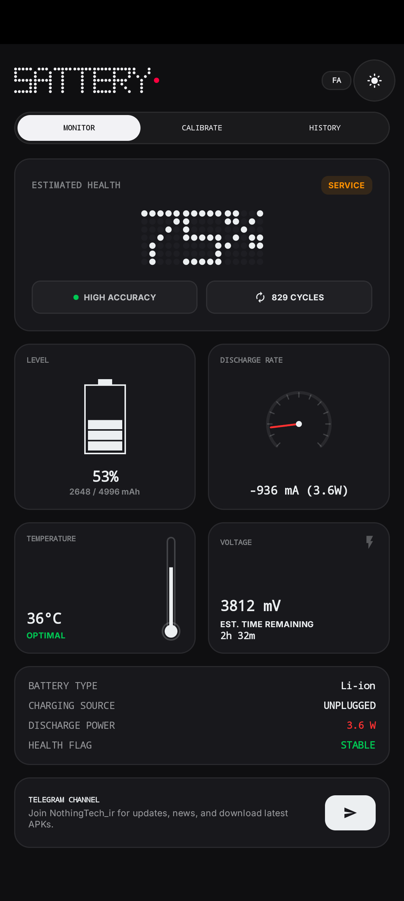
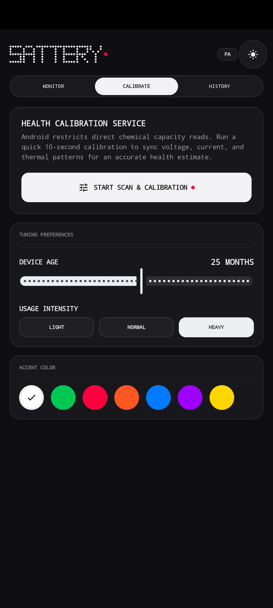
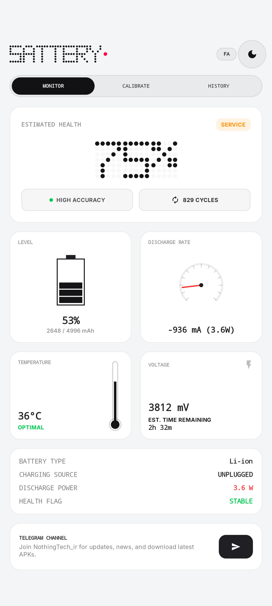

# 🔋 Sattery

> **Nothing UI Battery Health Monitor for Android**

An intelligent Android application for monitoring battery health, charging sessions, and real-time battery statistics. Sattery combines advanced battery analytics with a l Nothing-inspired UI to .

  
  
  
  

---

## ✨ Features

- 🔋 Intelligent Battery Health (SOH) estimation
- ⚡ Real-time battery monitoring
- 📊 Detailed charging session statistics
- 📈 Battery analytics (capacity, voltage, current, temperature, charging speed)
- 🕒 Charging history with long-term tracking
- 🎨 Beautifull Nothing-inspired UI
- 🌙 Dynamic Light & Dark theme
- ⚙️ Optimized for Android 14 & Android 15
- 🚀 Lightweight, fast and battery-efficient

---

## 🤝 Contributing

Contributions, feature requests, and bug reports are always welcome.

Made with ❤️

